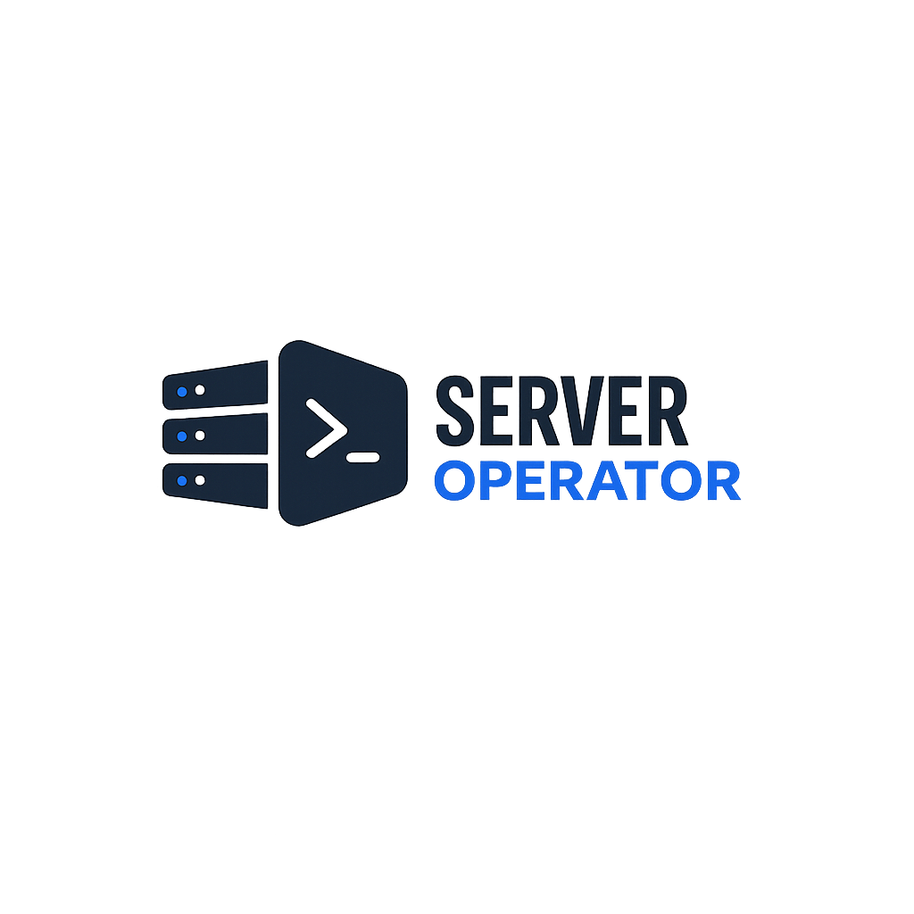
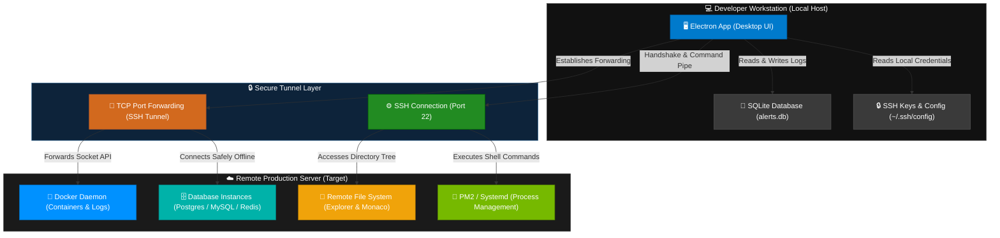

# ⚡ Server Operator ⚡

<p align="center">
  
</p>

<p align="center">
  <strong>Forged by BeForth</strong><br />
  A premium, high-performance desktop server manager and deployment environment built on Electron, React, and TypeScript.
</p>

<p align="center">
  <a href="LICENSE"></a>
  
  
</p>

---

## 🏗️ System Architecture & Data Flow

Server Operator connects to your remote Linux systems securely. The diagram below illustrates how local controls, database tunneling, processes, and remote files operate together.



---

## 🚀 Key Modules

Server Operator uses a **disabled-by-default modular architecture**. This keeps memory footprint minimal by running only what you need. Enable these components dynamically in the **Feature Settings**:

*   🖥️ **Connection Manager**: Fast SSH connections supporting private key keys, password authentication, and integrated Tor SOCKS5 proxying.
*   📂 **Remote File System Explorer**: Visual folder tree navigation with built-in Monaco Editor support, file creation, uploads, and downloads.
*   🐳 **Docker Console**: Instantly list active Docker containers (`docker ps -a`), inspect service logs, and rebuild configurations.
*   📦 **Database Suite**: Run database queries directly over the secure SSH tunnel connection. Includes syntax highlights for MySQL/PostgreSQL and autocomplete.
*   🚀 **Git Deployment Pipeline**: Trigger remote project updates, run migrations, install pip/npm dependencies, and view execution histories.
*   ⚙️ **Systemd & Nginx Wizards**: Generate reverse proxy configurations and service files with automated wizards.
*   🧠 **AI Diagnostic Assistant**: Get immediate diagnostic suggestions, query explanations, and command generation directly in your workspace.
*   📋 **Persistent Snippets & Notes**: Create localized snippets with parameter placeholders (`{{port}}`) and maintain clean, auto-saving checklists.

---

## 🔄 Deployment Pipeline Workflow

When you trigger a deploy, the agent runs a sequential build sequence locally or remotely:

```mermaid
graph LR
    subgraph GitRepo ["📦 Codebase (Git)"]
        git["🧑‍💻 Local Commits"]
    end

    subgraph SeropPipeline ["🚀 Serop Build & Deploy Pipeline"]
        pull["1. Git Pull & Reset"]
        deps["2. Auto Dependency Install"]
        mig["3. Run Migrations"]
        restart["4. Reload Application"]
        
        git --> pull
        pull --> deps
        deps --> mig
        mig --> restart
    end

    subgraph AuditLedger ["📊 Audit Logs & Rollbacks"]
        sqlite["SQLite Rollback Point Created"]
        restart --> sqlite
    end

    style GitRepo fill:#111,stroke:#333,color:#fff
    style SeropPipeline fill:#0d233a,stroke:#265c8a,color:#fff
    style AuditLedger fill:#1a1a1a,stroke:#444,color:#fff
    style git fill:#007acc,stroke:#00599c,color:#fff
    style pull fill:#f0a30a,stroke:#b87d00,color:#fff
    style deps fill:#76b900,stroke:#558200,color:#fff
    style mig fill:#d2691e,stroke:#a0522d,color:#fff
    style restart fill:#00b2a9,stroke:#008080,color:#fff
    style sqlite fill:#228b22,stroke:#006400,color:#fff
```



---

## 🛠️ Technology Stack

| Component | Technology | Description |
| :--- | :--- | :--- |
| **Runtime Framework** | Electron | Desktop container with native host capability |
| **User Interface** | React + TypeScript | Dynamic, component-driven client architecture |
| **Bundling Engine** | Vite | Ultra-fast asset building and hot module replacement |
| **Styling Engine** | Tailwind CSS | Utility-first CSS compiling |
| **Text Editor** | Monaco Editor | VS Code core text-editing engine |
| **Protocols** | SSH2 & Socks Client | Raw TCP stream encapsulation and Tor routing |
| **Storage & Audit** | SQLite | Local database configuration ledger |

---

## 💻 Local Setup & Installation

Follow these steps to set up the development environment locally:

### 1. Install Dependencies
Ensure you have Node.js installed, then install package packages:
```bash
npm install
```

### 2. Run in Development Mode
Start the Vite server and Electron concurrently with live reloading:
```bash
npm run electron:dev
```

### 3. Package Production Release
Compile release binaries for your host operating system:
```bash
npm run electron:build
```
Builds will be compiled and placed under the `/release` directory.

---

### ⚠️ macOS "App is Damaged" Troubleshooting

Because local or unsigned macOS builds are not code-signed or notarized with an Apple Developer account, macOS Gatekeeper will block them, showing a warning that the app is "damaged and can't be opened".

To resolve this on your system:
1. Copy `Server Operator.app` to your `/Applications` folder.
2. Open your terminal and run:
   ```bash
    xattr -cr /Applications/Serop.app  
   ```
This strips the quarantine attribute and allows the application to launch successfully.

---

## 🔌 Project Codebase Initializer (CLI)

Bootstrap standardized deployment recipes inside any repository:

```bash
# Initialize Serop configs inside your project repository
npm run serop:init:interactive -- --path /path/to/your/project
```

This creates a local `.server-operator/` configuration folder containing:
*   `deploy.serop`: Custom script shortcuts.
*   `AI_CONTEXT.md`: High-level system descriptions for AI diagnostic assistance.
*   `INSTALLATION_CONTEXT.md`: Required operating dependencies.

---

## 📄 License

Copyright © 2026 **BeForth**. All rights reserved.

Licensed under the **Apache License, Version 2.0** (the "License"). You may obtain a copy of the License at:
[http://www.apache.org/licenses/LICENSE-2.0](http://www.apache.org/licenses/LICENSE-2.0)
